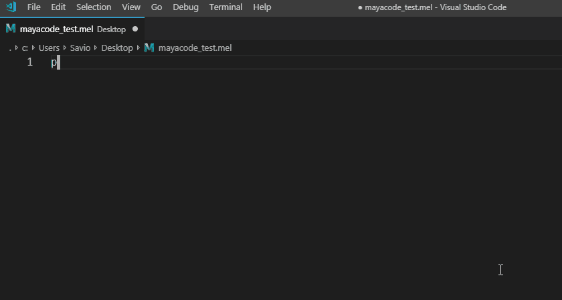
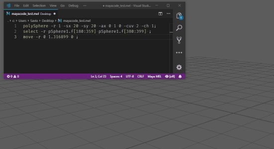

# Maya Extension for Visual Studio Code

[](https://marketplace.visualstudio.com/items?itemName=saviof.mayacode)
[](https://marketplace.visualstudio.com/items?itemName=saviof.mayacode)
[](https://twitter.com/artbycrunk)
[](https://gitter.im/vscode-maya/vscode-maya)


A [Visual Studio Code](https://code.visualstudio.com/) [extension](https://marketplace.visualstudio.com/items?itemName=saviof.mayacode) with support for coding for Maya.

## Features

* Autocomplete MEL commands as you type ( along with flag info )

  > 

* Send code to Maya via command port (MEL or Python).

  > 

* Syntax Highlight MEL scripts.
* Support auto closing brackets, quotes and ticks

  > 

## Useful commands

Open the Command Palette (Command+Shift+P on macOS and Ctrl+Shift+P on Windows/Linux) and type in one of the following commands:

Command | Description
--- | ---
```Maya: Send Python Code to Maya``` | Send Python code from current editor in Maya.
```Maya: Send MEL Code to Maya``` | Send MEL code from current editor in Maya.

You can also select a block of code in the editor 
and ```Right-click -> Send Code to Maya```, this is based on the current working language (Mel or Python).


## Opening the correct ports for Send to Maya Commands.

To open the correct ports in maya, you can use the following code.

`Note: If your using a extension version higher than 0.9, then MEL and Python code use the same port in maya.`

In the Maya script editor MEL Tab.
```
commandPort -name "localhost:7001" -sourceType "mel" -echoOutput;
```

## Snippets

|Prefixes|Description|
|--------|-----------|
|if|Code snippet for an if statement|
|if/else|Code snippet for an if statement with else|
|elseif|Code snippet for an else if|
|else|Code snippet for an else|
|do/while|Code snippet for a do while loop|
|switch/case|Code snippet for a switch case|
|proc|Code snippet for a procedure|
|proc(global)|Code snippet for a global procedure|
|for/in|Code snippet for a for loop|
|for|Code snippet for a for loop with counter|
|while|Code snippet for a for while loop|

## Requirements

Autodesk Maya tested using Maya 2016 Windows and Linux but should work with all versions.

## Issues, feature requests, and contributions

* If you come across a problem with the extension, please [file an issue](https://github.com/artbycrunk/vscode-maya)
* Contributions are always welcome!
* Any and all feedback is appreciated and welcome!
  - If someone has already [filed an issue](https://github.com/artbycrunk/vscode-maya) that encompasses your feedback, please leave a 👍/👎 reaction on the issue
  - Otherwise please file a new issue

## Release Notes

See [CHANGELOG.md](./CHANGELOG.md)

**Enjoy!**
